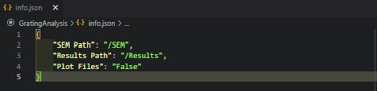
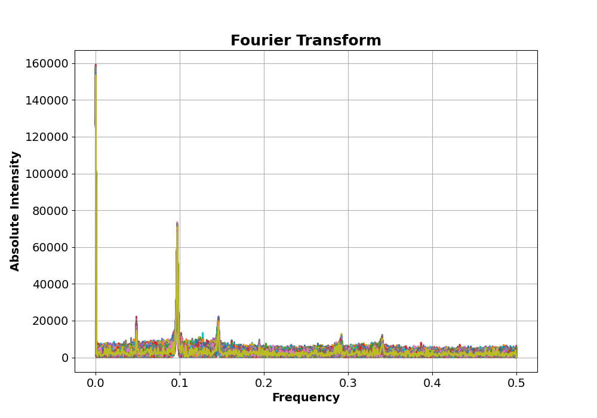
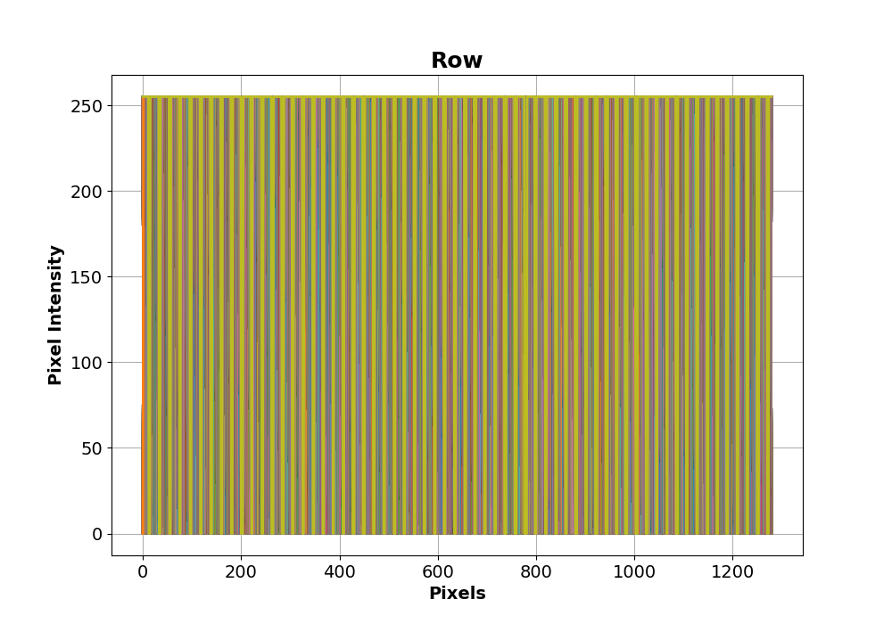

# Microscopy Period Analysis

This software is designed for analysis of resonant structures, namely resonant gratings or periodic structures. Specifically the software looks for periodic patterns in images and calculates the period of the structure. To date, the software is designed for use with 1D resonant gratings analysed with a scanning electron microscope.

This software was created by Josh Male in November 2022 as part of the ongoing analysis of resonant structures. The code is under an MIT License and can be freely used.

## Table of Contents

* [General Information](#general-information)
* [Package Requirements](#package-requirements)
* [Launch](#launch)
* [Setup](#setup)
  * [Directory Paths](#directory-paths)
  * [SEM File Names](#sem-file-names)
  * [SEM File Types](#sem-file-types)
  * [Default info.json](#default-info)
* [General Work Flow](#general-work-flow)
  * [Organisation](#organisation)
  * [Data Handling](#data-handling)
  * [Parent Directory](#parent-directory)
  * [Batch Processing](#batch-processing)
  * [Find File Paths](#find-file-paths)
* [Periodic Analysis](#periodic-analysis)
  * [SEM Data Input](#sem-data-input)
  * [SEM Parameter Calculations](#sem-parameter-calculations)
  * [Calculate Grating Period](#calculate-grating-period)
  * [Thresholding Data](#thresholding-data)
  * [Plotting SEM Results](#plotting-sem-results)
  * [Average Periods](#average-periods)
* [Acknowledgements]

## General Information

Automatic frequency/period finder built using Python 3 to find the grating period of a 1D resonant structure. Suitable for JEOL SEM images, adaptable for any grating image.

## Package Requirements

Language and package requirements can also be found in requirements.txt. The code was built using the following languages and module versions.

* Python 3.6
* tk 0.1.0
* numpy 1.21.4
* matplotlib 3.5.0
* scipy 1.7.2
* Pillow 8.4.0

## Launch

The code can be run from any terminal or editor. Main scripts are in the repository's main directory, while source code is stored safely in /src. The code relies on hte use of info.json file for non-windows operating systems, this should be kept in the main repository directory.

## Setup

### Directory Paths

The code relies heavily on the info.json file for non-windows operating systems for data and results directory paths, this is to relieve pressure from any users from altering the script, and to ensure user alterations don't break the code. The info.json file should contain the following file paths:

* {
    "SEM Path": "/relative/path/to/SEM/images",
    "Results Path": "/relative/path/to/results",
    "Plot Files": "True/False"
}

Where the relative paths are relative to the root directory (main directory of the repository). Windows devices make use of tkinter's interactive path selector and are able to select target files directly, but will require both paths to be present to find log files and save out results. Default paths are set to:

* {
    "SEM Path": "/SEM",
    "Results Path": "/Results",
    "Plot Files": "False"
}

The code is able to distinguish between images and log files using the file extensions.

### SEM File Names

Handling data and information is always a challenging aspect of coding. It's far easier to convey specific file information within the file name itself than to have a bank of dictionaries, text files, or other storage format files somewhere with all the relevant information required for data processing. This software is no different, and as such, there are specific pieces of information that are required from the file name that needs to be included, these are:

* Primary sample identifier string:
  * This may be a string like "A1", "Sample1", or "CharacterisationSample17". Either way, there must be some form of sample identifier within the file name.
  * This string must be one word.
* Secondary sample identifier string:
  * This is required for batch storage purposes and is used to group measurements from the same sample into one results dictionary and allows the dictionary keys to remain separate as to not overwrite data.
  * This string may be something like "P250" for a grating period of 250nm, "Grating1", "SecondFromLeft", etc. and it must be one word.
* Grating Period:
  * The software uses a design grating period to compare data thresholding methods to find a true value for grating period.
  * As such, there must be a string within the file name that contains the "Px" where x is the period in nm.
  * This string must also be one word.
  * For now, the grating period string must be the secondary string.
* The primary, secondary, and grating period strings must be separated from each other, and the remaining information contained within the file name using the "_" character (underscore character).
  * An example file name would be - "A1_P250_Grating.bmp".
  * Primary and secondary identifier strings must be first and second in the file name string.
  * Any information in the first two "_" separated file name segments will be called into the code regardless of their nature.
* SEM log files, .txt files, that are automatically saved in JEOL SEM systems must have the same file name as the image files they correspond to.

### SEM File Types

The default output from JEOL SEM systems are .bmp and .txt files for images and log files respectively. As such, the code has been designed to operate with these file types but can easily be adjusted for other image formats and text document formats. All output files are .json dictionaries, which is one of the standard file types for outputting data in python software. The software does not, by default, output any graphs, but this can be changed by altering the "Plot Files" key in the info dictionary to "True". Doing this will ensure that all figures are plotted from the Fourier transform and data thresholding functions. Note that all figures are saved as png files.

### Default Info

As discussed in this section, all the user interface is done through the info.json file included in the main directory of the repository. This file can be opened using any text editor, and can be adjusted by the user with little-to-no consequence. The default info.json looks lik this:

## General Work Flow

This section contains general work flow details for code setup, data handling, batch processing, and a variety of other general features of the code.

### Organisation

The initial section of the code is concerned with finding directory and file paths required to process the data. This process is highly dependent on the operating system due to the relationship between tkinter and non-windows operating systems. The code makes use of pathlib's Path for file and directory paths, to maintain utility across operating systems, and sets the root directory as the main directory of the repository.

Details in the info.json setup file, including directory paths, are pulled in the function get_directory_paths, which builds the relative paths based on the set root path, which can be changed by adjusting the root variable. The directory paths is then treated as a dictionary containing the set directory paths by the user. File paths are returned as an array depending on operating system. If operating system is windows, the user can select which files they would like to process, if operating system is not windows, the user must have all desired files in the set directories as all files in those directories will be processed.

### Data Handling

Primary, secondary, and any other identifier strings are pulled from the file name string using a sample_information function, which pulls all required parameters for the code from the file name and places them in a dictionary with clear identifier keys. The values of this dictionary are then used throughout the code to pull in required parameters. Therefore, this dictionary is referred to as sample_parameters throughout.

### Parent Directory

Parent directory is discussed above in directory paths. The code relies on relevant data being stored in the correctly named directory, allowing the code to distinguish between different file types. The parent directory names should be clear as discussed above. The parent directory is found using the function get_parent_directory, which returns a string of the parent directory name, which is then used as a parameter identifier key throughout.

### Batch Processing

For batch processing, indicated by the batch_ in either the script name or function name, the code then looks for like-filme names, typically with the same primary identifier string, and groups them together separated by secondary identifier string.

Batches are found using find_all_batches function, which matches primary identifier strings, groups the file names, file paths, and secondary string names together and returns a batch dictionary.

Using the batch keys and file paths stored within the batches dictionary, the code begins by pulling file names, file paths, and secondary identifer strings into a batch results dictionary and appending each subsequent file parameters into an array under the appropriate keys. The parent directory is used from here as a key identifier. The batch results utilises sample_information function in filepaths to pull this information in.

### Find File Paths

As discussed above, finding file paths is operating system dependent. On windows operating systems, the code uses tkinter's interactive file selection tool and allows the user to select any of the files in a directory they would like to process. In other operating systems, where tkinter is not so native, the code looks for all suitable files within the data directory and will process all of them, unless results have already been optained and the results file exists.

## Periodic Analysis

This section contains work flow details to better understand how the code is put together and what processes are undertaken in finding the grating period of a periodic structure.

### SEM Data Input

Data is pulled in using the read_image and read_SEM_log files, where the outputted text log file is stripped of extra characters, and the key parameters from the SEM image are captured and stored in a dictionary. The image is handled as an array from this point on.

Important information from the file is pulled into a dictionary using the sample_information function discussed above. The same process is then applied to the log file. In the situation where a log file does not exist, the code passes onto another image. Ths process cannot continue without a log file due to key parameters such as distance per pixel and image size being stored within the log file.

### SEM Parameter Calculations

Using the log file, two parameters are calculated. The first is the image size. JEOL SEM systems produce images with a banner below showing key SEM column parameters that would not be suitable to Fourier transform. In the log file, the image size is stored and pulled into the log dictionary. Using the trim_img_to_roi function, the dictionary image height and width is pulled in and the image can be trimmed to remove this banner.

Using the log file, the code can calculate the scale of the image and can then know the distance (in pixels) per unit distance (um) across the image. This is another key parameter stored in the log file, without which it is impossible to calculate the grating period in any unit other than pixels.

The code uses a unit converter to produce grating periods in nm, this dictionary is stored within calc_distance_per_pixel.

### Calculate Grating Period

The grating period can be calculated by looking at the Fourier transform of the input image. This is done row-by-row and averaged across the height of the image. The code looks at the Fourier transform of each row and finds the 5 most prominent peaks in Fourier space. Using these five peaks, and finding the corresponding frequency peaks, it is possible to translate these values into real space (period space) and return the calculated periods of each of these peaks.

To decide which five peaks to pick, the code uses scipy's prominence function to determine which peaks are most prominent in Fourier space. Using the distance per pixel, row size, and frequency space measurements, performing the inverse Fourier transform is trivial, and the code returns the corresponding period values.

As the grating period is going to be the largest period, smallest frequency, value, the code uses the maximum returned period as the grating period and uses the standard error on the mean equation to calculate a grating period error.

### Thresholding Data

Sometimes, depending on cleanliness of sample, accuracy of SEM column, and brightness/contrast settings, it is possible that the SEM images are not as clear as the Fourier transform would require to get perfect period measurements. Hence, we may need to threshold the data and transform the analog signal into a binary wave.

This is done using thresholding methods "Mean", "Mean-StdDev", and "Mean+StdDev", which applies a mean value, mean value - standard deviation, and mean value + standard deviation threshold respectively. The code calculate the mean pixel value and the standard deviation of the pixel value. Any value above the threshold is set to maximum pixel value, anything below is set to minimum pixel value.

The code uses the design grating period to then optimise which thresholding method is most appropriate for the input data.

### Plotting SEM Results

If "Plot Files" is set to true, the code will plot 10 rows of thresholded data and the Fourier space peaks to ensure that the Fourier transform and peak finding algorithm is performing as expected. This is usually not necessary, but unusual grating images may require double checking.

### Average Periods

For batch processing, there may be multiple files for the same grating. Therefore the code would find multiple grating period values for different images but for the same chip. Using their secondary keys, the values produced for each image can be grouped and averaged to produce an average grating period per grating from multiple images.

## Acknowledgements

Thanks go to George for refactoring efforts.
